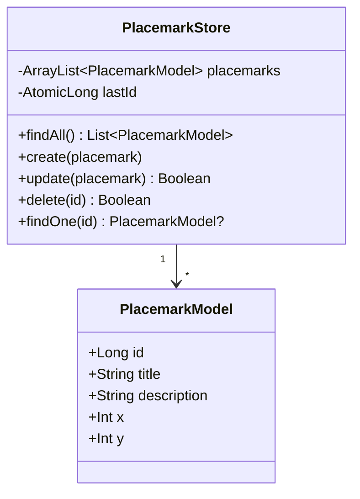

## Class diagram

```mermaid
classDiagram
    class PlacemarkStore {
        -ArrayList~PlacemarkModel~ placemarks
        -AtomicLong lastId
        +findAll() List~PlacemarkModel~
        +create(placemark)
        +update(placemark) Boolean
        +delete(id) Boolean
        +findOne(id) PlacemarkModel?
    }
    class PlacemarkModel {
        +Long id
        +String title
        +String description
        +Int x
        +Int y
    }
    PlacemarkStore "1" --> "*" PlacemarkModel
```
